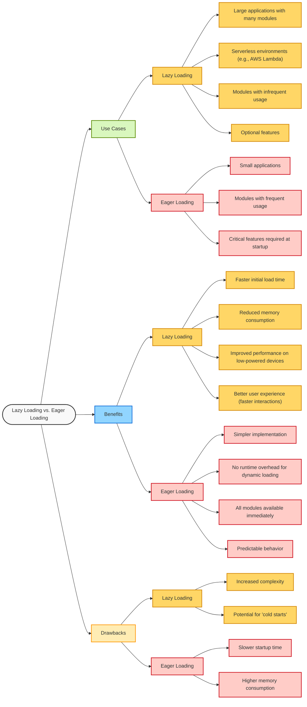
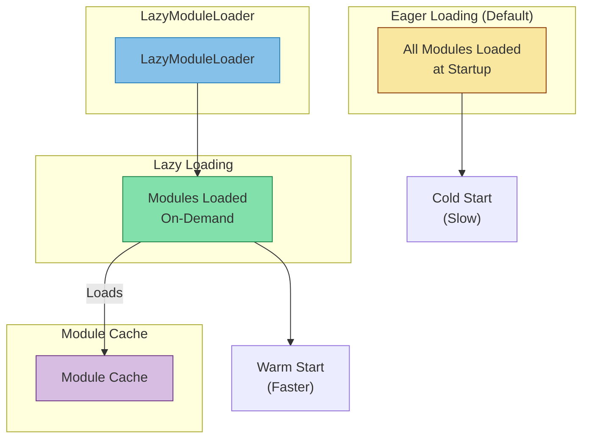
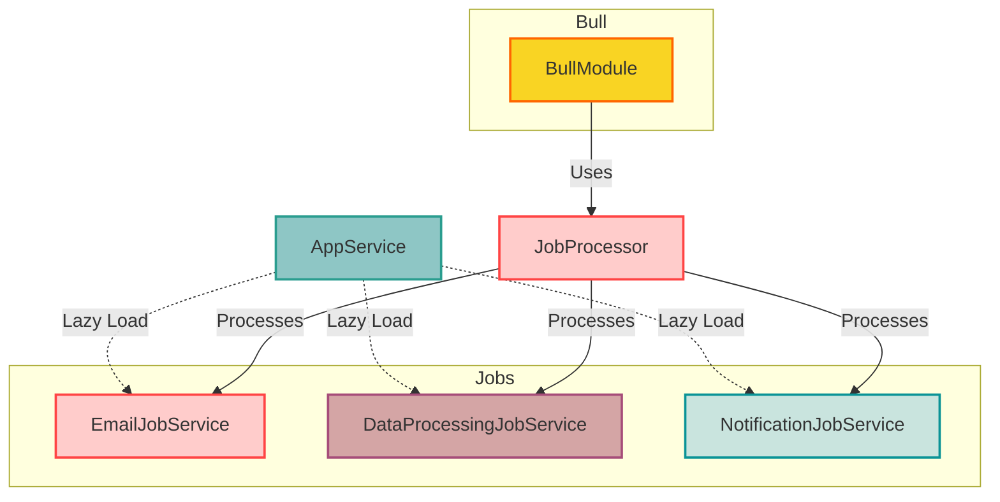

# NestJS Lazy Loading Modules 

## Lazy loading vs. Eager loading



## LazyModuleLoader



## Scenario



Imagine you have a NestJS worker responsible for processing various types of jobs:

- EmailJob: Sends promotional emails to customers.
- DataProcessingJob: Analyzes large datasets for insights.
- NotificationJob: Pushes notifications to users.

Since each job type has its own dependencies and may not be executed frequently, eager loading all modules at startup could lead to unnecessary resource consumption. Instead, we can use lazy loading to load the required modules only when needed.

## Implementation

```bash
nest-lazy-loading-modules
│
├── dist
├── node_modules
├── src
│   ├── job-processor
│   │   ├── job-processor.module.ts
│   │   └── job-processor.processor.ts
│   ├── jobs
│   │   ├── data-processing-job
│   │   │   └── data-processing-job.service.ts
│   │   ├── email-job
│   │   │   └── email-job.service.ts
│   │   └── notification-job
│   │       └── notification-job.service.ts
│   ├── app.module.ts
│   ├── app.service.ts
│   └── main.ts

```

### JobProcessor
The JobProcessor class is responsible for processing different types of jobs. We use dynamic imports to load the required job services lazily when a job is processed.
```typescript
// src/job-processor/job-processor.processor.ts
import { Process, Processor } from '@nestjs/bull';
import { Job } from 'bull';

@Processor('jobQueue')
export class JobProcessor {
  @Process('EmailJob')
  async handleEmailJob(job: Job) {
    console.log('Processing EmailJob...');
    const { EmailJobService } = await import(
      '../jobs/email-job/email-job.service'
    );
    const emailJobService = new EmailJobService();
    emailJobService.handleJob(job.data);
  }

  @Process('DataProcessingJob')
  async handleDataProcessingJob(job: Job) {
    console.log('Processing DataProcessingJob...');
    const { DataProcessingJobService } = await import(
      '../jobs/data-processing-job/data-processing-job.service'
    );
    const dataProcessingJobService = new DataProcessingJobService();
    dataProcessingJobService.handleJob(job.data);
  }

  @Process('NotificationJob')
  async handleNotificationJob(job: Job) {
    console.log('Processing NotificationJob...');
    const { NotificationJobService } = await import(
      '../jobs/notification-job/notification-job.service'
    );
    const notificationJobService = new NotificationJobService();
    notificationJobService.handleJob(job.data);
  }
}

```
### Job Service
Each job service class contains the logic for processing a specific type of job. For example, the EmailJobService class handles the logic for sending promotional emails to customers.
```typescript
import { Injectable } from '@nestjs/common';

@Injectable()
export class EmailJobService {
  handleJob(data: any) {
    console.log(`Handling Email Job with data: ${JSON.stringify(data)}`);
    // Logic for sending promotional emails
  }
}

```

### AppService
The AppService class is responsible for adding jobs to the queue when the application starts. We use the OnModuleInit lifecycle hook to add jobs to the queue.
```typescript
import { Injectable, OnModuleInit } from '@nestjs/common';
import { InjectQueue } from '@nestjs/bull';
import { Queue } from 'bull';

@Injectable()
export class AppService implements OnModuleInit {
  constructor(@InjectQueue('jobQueue') private readonly jobQueue: Queue) {}

  async onModuleInit() {
    // Adding jobs to the queue
    console.log('Adding jobs to the queue');
    try {
      await this.jobQueue.add('EmailJob', { data: 'some data for email job' });
      await this.jobQueue.add('DataProcessingJob', {
        data: 'some data for data processing job',
      });
      await this.jobQueue.add('NotificationJob', {
        data: 'some data for notification job',
      });
    } catch (error) {
      console.error('Error adding jobs to the queue', error);
    }
  }
}

```

## TEST
Start the application by running the following command:
```bash
npm run start
```
Logs should be displayed in the console, indicating that the application has started successfully and is processing the different types of jobs:
```bash
Adding jobs to the queue
[Nest] 29036  - 06/28/2024, 9:48:55 AM     LOG [NestApplication] Nest application successfully started +16ms
Processing EmailJob...
Processing DataProcessingJob...
Handling Email Job with data: {"data":"some data for email job"}
Handling Data Processing Job with data: {"data":"some data for data processing job"}
Processing NotificationJob...
Handling Notification Job with data: [object Object]
```
## Conclusion
Lazy loading is beneficial for large, modular applications, optimizing performance and resource use. Eager loading suits smaller applications where critical features must be immediately available. Choosing the right approach depends on application size, usage patterns, and performance requirements. Each strategy has its own benefits and drawbacks to consider. Balancing lazy and eager loading can optimize application performance and resource utilization.
