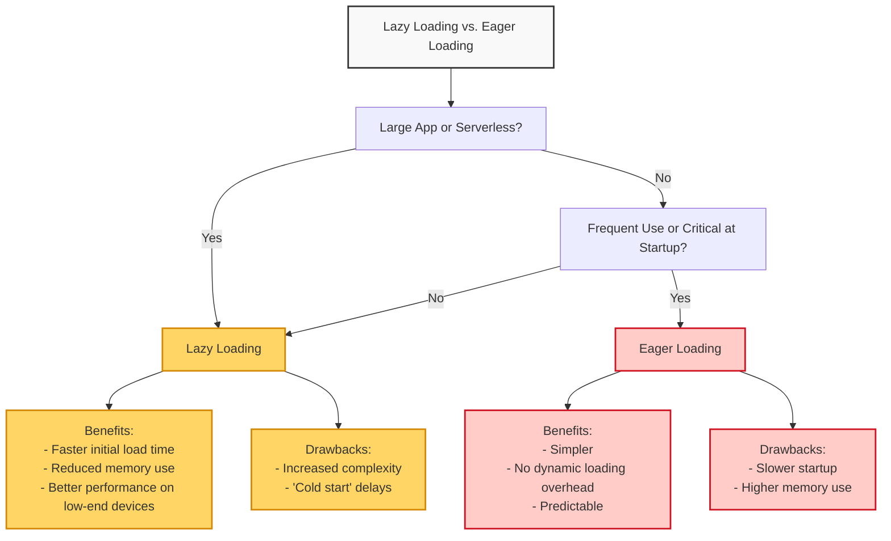
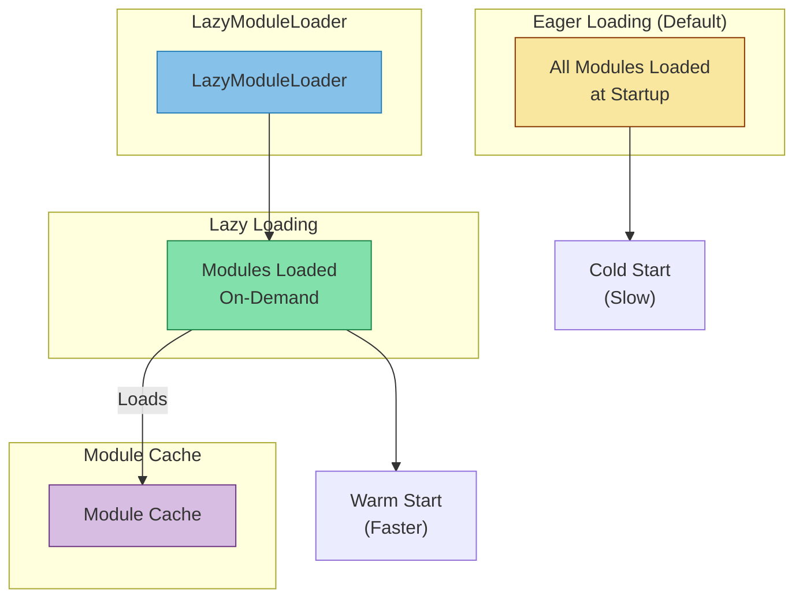
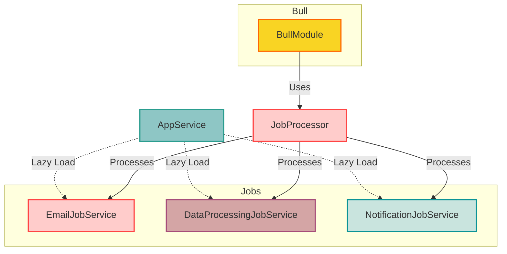

# NestJS Lazy Loading Modules 

## Lazy loading vs. Eager loading



## LazyModuleLoader



## Scenario



Imagine you have a NestJS worker responsible for processing various types of jobs:

- **EmailJob**: Sends promotional emails to customers.
- **DataProcessingJob**: Analyzes large datasets for insights.
- **NotificationJob**: Pushes notifications to users.

Since each job type has its own dependencies and may not be executed frequently, eager loading all modules at startup could lead to unnecessary resource consumption. Instead, we can use **lazy loading** to load the required modules only when needed.

## Implementation

```bash
nest-lazy-loading-modules
│
├── dist
├── node_modules
├── src
│   ├── job-processor
│   │   ├── job-processor.module.ts
│   │   └── job-processor.processor.ts
│   ├── jobs
│   │   ├── data-processing-job
│   │   │   └── data-processing-job.service.ts
│   │   ├── email-job
│   │   │   └── email-job.service.ts
│   │   └── notification-job
│   │       └── notification-job.service.ts
│   ├── app.module.ts
│   ├── app.service.ts
│   └── main.ts

```

### JobProcessor
The JobProcessor class is responsible for processing different types of jobs. We use dynamic imports to load the required job services lazily when a job is processed.
```typescript
// src/job-processor/job-processor.processor.ts
// src/job-processor/job-processor.processor.ts
import { Process, Processor } from '@nestjs/bull';
import { Job } from 'bull';
import { LazyModuleLoader } from '@nestjs/core';

@Processor('jobQueue')
export class JobProcessor {
  constructor(private readonly lazyModuleLoader: LazyModuleLoader) {}

  @Process('EmailJob')
  async handleEmailJob(job: Job) {
    console.log('Processing EmailJob...');
    const { EmailJobModule } = await import(
      '../jobs/email-job/email-job.module'
      );
    const moduleRef = await this.lazyModuleLoader.load(() => EmailJobModule);
    const emailJobService = moduleRef.get('EmailJobService');
    emailJobService.handleJob(job.data);
  }

  @Process('DataProcessingJob')
  async handleDataProcessingJob(job: Job) {
    console.log('Processing DataProcessingJob...');
    const { DataProcessingJobModule } = await import(
      '../jobs/data-processing-job/data-processing-job.module'
      );
    const moduleRef = await this.lazyModuleLoader.load(
      () => DataProcessingJobModule,
    );
    const dataProcessingJobService = moduleRef.get('DataProcessingJobService');
    dataProcessingJobService.handleJob(job.data);
  }

  @Process('NotificationJob')
  async handleNotificationJob(job: Job) {
    console.log('Processing NotificationJob...');
    const { NotificationJobModule } = await import(
      '../jobs/notification-job/notification-job.module'
      );
    const moduleRef = await this.lazyModuleLoader.load(
      () => NotificationJobModule,
    );
    const notificationJobService = moduleRef.get('NotificationJobService');
    notificationJobService.handleJob(job.data);
  }
}


```
### Job Module

Each job type has its own module and service class. 
The service class contains the logic for processing the job.

#### EmailJobModule

```typescript
// src/jobs/email-job/email-job.module.ts
import { Module } from '@nestjs/common';
import { EmailJobService } from './email-job.service';

@Module({
  providers: [EmailJobService],
  exports: [EmailJobService],
})
export class EmailJobModule {}

```
#### EmailJobService
```typescript
import { Injectable } from '@nestjs/common';

@Injectable()
export class EmailJobService {
  handleJob(data: any) {
    console.log(`Handling Email Job with data: ${JSON.stringify(data)}`);
    // Logic for sending promotional emails
  }
}

```

### AppService
The AppService class is responsible for adding jobs to the queue when the application starts. We use the OnModuleInit lifecycle hook to add jobs to the queue.
```typescript
import { Injectable, OnModuleInit } from '@nestjs/common';
import { InjectQueue } from '@nestjs/bull';
import { Queue } from 'bull';

@Injectable()
export class AppService implements OnModuleInit {
  constructor(@InjectQueue('jobQueue') private readonly jobQueue: Queue) {}

  async onModuleInit() {
    // Adding jobs to the queue
    console.log('Adding jobs to the queue');
    try {
      await this.jobQueue.add('EmailJob', { data: 'some data for email job' });
      await this.jobQueue.add('DataProcessingJob', {
        data: 'some data for data processing job',
      });
      await this.jobQueue.add('NotificationJob', {
        data: 'some data for notification job',
      });
    } catch (error) {
      console.error('Error adding jobs to the queue', error);
    }
  }
}

```

## TEST

### Install Redis

If you don't have Redis installed, you can install it using the following commands:

On **macOS** using Homebrew:
```bash
brew install redis
```

Start Redis:
```bash
brew services start redis
```

On **Ubuntu**:
```bash
sudo apt update
sudo apt install redis-server
```

Start Redis:
```typescript
sudo service redis-server start
```

On **Window**

You can download Redis from the official Redis here: [Redis](https://redis.io/docs/latest/operate/oss_and_stack/install/install-redis/install-redis-on-windows/)

#### Verify Redis Installation
```bash
redis-cli ping
```
### Start Application

Start the application by running the following command:
```bash
npm run start
```
Logs should be displayed in the console, indicating that the application has started successfully and is processing the different types of jobs:
```bash
[Nest] 41298  - 06/29/2024, 6:05:31 PM     LOG [NestFactory] Starting Nest application...
[Nest] 41298  - 06/29/2024, 6:05:31 PM     LOG [InstanceLoader] BullModule dependencies initialized +8ms
[Nest] 41298  - 06/29/2024, 6:05:31 PM     LOG [InstanceLoader] DiscoveryModule dependencies initialized +0ms
[Nest] 41298  - 06/29/2024, 6:05:31 PM     LOG [InstanceLoader] JobProcessorModule dependencies initialized +0ms
[Nest] 41298  - 06/29/2024, 6:05:31 PM     LOG [InstanceLoader] BullModule dependencies initialized +3ms
[Nest] 41298  - 06/29/2024, 6:05:31 PM     LOG [InstanceLoader] BullModule dependencies initialized +0ms
[Nest] 41298  - 06/29/2024, 6:05:31 PM     LOG [InstanceLoader] BullModule dependencies initialized +0ms
[Nest] 41298  - 06/29/2024, 6:05:31 PM     LOG [InstanceLoader] AppModule dependencies initialized +0ms
Adding jobs to the queue
[Nest] 41298  - 06/29/2024, 6:05:31 PM     LOG [NestApplication] Nest application successfully started +12ms
[Nest] 41298  - 06/29/2024, 6:05:31 PM     LOG [LazyModuleLoader] EmailJobModule dependencies initialized
Handling Email Job with data: {"data":"some data for email job"}
Processing DataProcessingJob...
Processing NotificationJob...
[Nest] 41298  - 06/29/2024, 6:05:31 PM     LOG [LazyModuleLoader] DataProcessingJobModule dependencies initialized
[Nest] 41298  - 06/29/2024, 6:05:31 PM     LOG [LazyModuleLoader] NotificationJobModule dependencies initialized
Handling Data Processing Job with data: {"data":"some data for data processing job"}
Handling Notification Job with data: {"data":"some data for notification job"}

```
## Conclusion
Lazy loading is beneficial for large, modular applications, optimizing performance and resource use. Eager loading suits smaller applications where critical features must be immediately available. Choosing the right approach depends on application size, usage patterns, and performance requirements. Each strategy has its own benefits and drawbacks to consider. Balancing lazy and eager loading can optimize application performance and resource utilization.
