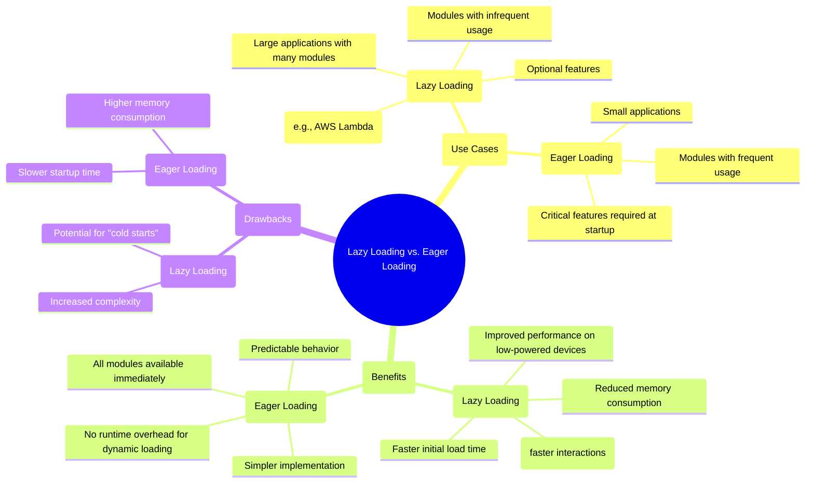
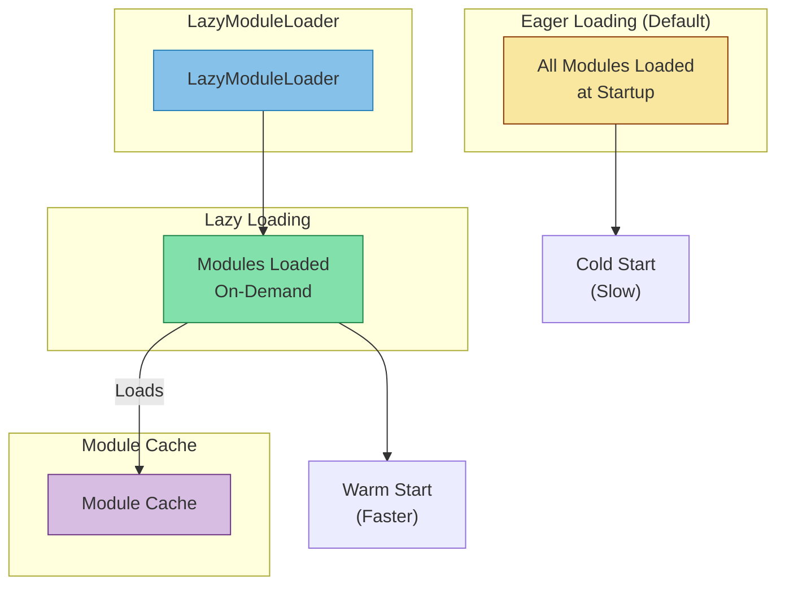
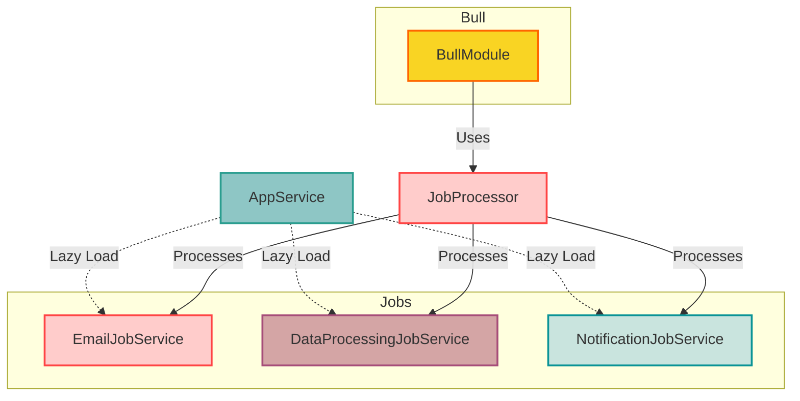

# NestJS Lazy Loading Modules 

## Lazy loading vs. Eager loading

## LazyModuleLoader

## Scenario

Imagine you have a NestJS worker responsible for processing various types of jobs:

- EmailJob: Sends promotional emails to customers.
- DataProcessingJob: Analyzes large datasets for insights.
- NotificationJob: Pushes notifications to users.

Since each job type has its own dependencies and may not be executed frequently, eager loading all modules at startup could lead to unnecessary resource consumption. Instead, we can use lazy loading to load the required modules only when needed.

