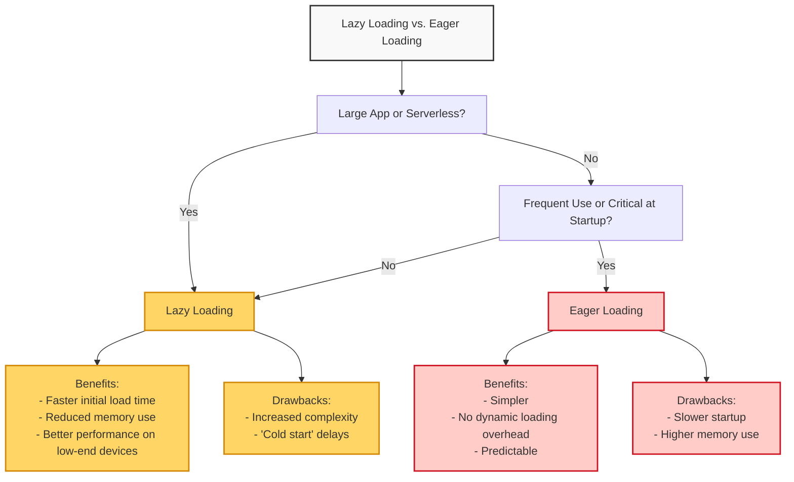
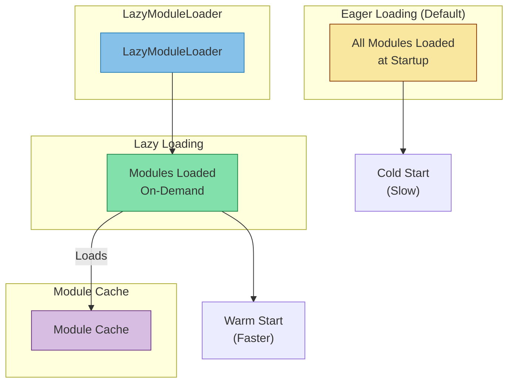
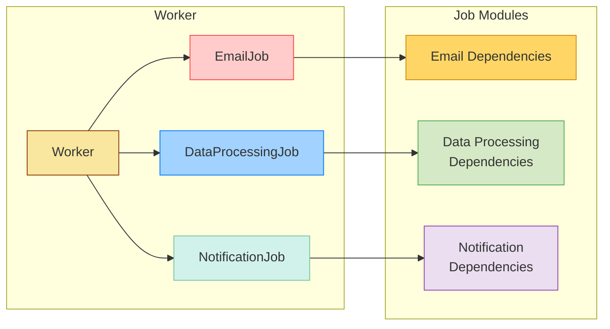
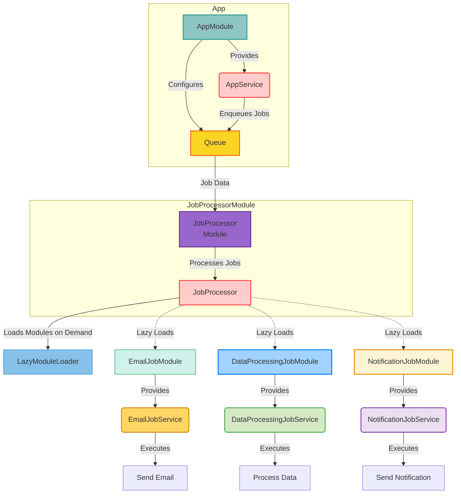
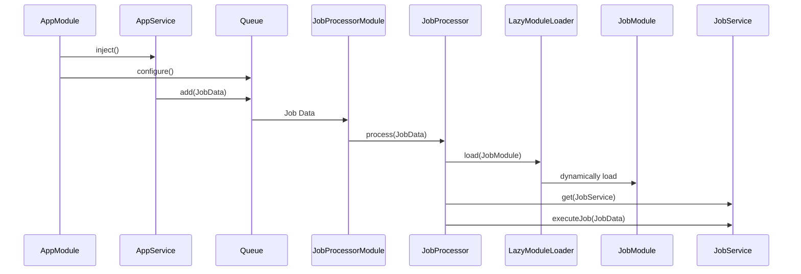

# NestJS Lazy Loading Modules 

## Lazy loading vs. Eager loading

###  Lazy Loading



**Large Application with Many Modules**: If your application has a complex structure with numerous modules, the initial startup time can be significant if all modules are loaded eagerly. Lazy loading becomes beneficial here, as it only loads modules when they are actually needed, resulting in a faster initial startup.

**Serverless Environment**: Serverless platforms charge based on execution time. Lazy loading is crucial here because it reduces the cold start time (the time it takes for a function to initialize before executing). By only loading necessary modules for each request, you optimize performance and reduce costs.


## LazyModuleLoader

This is a utility class provided by NestJS to facilitate lazy loading. It handles the dynamic loading of modules at runtime.
When a lazily loaded module is requested, the LazyModuleLoader fetches it from the file system (or cache) and loads it into memory, making it available for use.



## Scenario

Imagine you have a NestJS worker responsible for processing various types of jobs:

- **EmailJob**: Sends promotional emails to customers.
- **DataProcessingJob**: Analyzes large datasets for insights.
- **NotificationJob**: Pushes notifications to users.

Since each job type has its own dependencies and may not be executed frequently, eager loading all modules at startup could lead to unnecessary resource consumption. Instead, we can use **lazy loading** to load the required modules only when needed.



## Solution


The NestJS worker, a versatile task orchestrator, dynamically allocates resources through lazy loading. Leveraging the powerful **Bull queueing system**, it efficiently manages incoming jobs.  
Instead of preemptively loading all job-specific modules, it employs the LazyModuleLoader to load dependencies on demand, triggered by the arrival of a job in the Bull queue. This streamlined approach not only optimizes memory consumption and minimizes startup time but also ensures efficient execution tailored to each specific job, akin to a surgical team assembling tools for a particular procedure. The worker's dynamic resource allocation, combined with Bull's robust queue management, promotes scalability and resource efficiency while maintaining the flexibility to handle a variety of tasks.

#### JobProcessor: The Coordinator
In our scenario, the JobProcessor serves as the core of the worker application, performing the following tasks:

- **Queue Listening**: Subscribes to the Bull queue, awaiting new jobs.
- **Job Reception**: Receives job data, including job type and payload.
- **Job Type Identification**: Determines the job type from the received data.
- **Lazy Loading Modules**: Utilizes LazyModuleLoader to dynamically load the appropriate module (e.g., EmailJobModule) based on the job type.
- **Service Retrieval**: Retrieves the corresponding service (e.g., EmailJobService) from the loaded module.
- **Job Execution**: Delegates job execution to the service, passing the job data for processing.




## Implementation

```bash
src
├── app.controller.ts
├── app.module.ts
├── app.service.ts
├── job-processor
│   ├── job-processor.module.ts
│   └── job-processor.processor.ts
├── jobs
│   ├── data-processing-job
│   │   ├── data-processing-job.module.ts
│   │   └── data-processing-job.service.ts
│   ├── email-job
│   │   ├── email-job.module.ts
│   │   └── email-job.service.ts
│   └── notification-job
│       ├── notification-job.module.ts
│       └── notification-job.service.ts
└── main.ts

```

### JobProcessor Module

The **JobProcessorModule** class is responsible for importing the JobProcessor class and the BullModule to create a queue for processing jobs.

```typescript
// src/job-processor/job-processor.module.ts
import { Module } from '@nestjs/common';
import { BullModule } from '@nestjs/bull';
import { JobProcessor } from './job-processor.processor';

@Module({
  imports: [
    BullModule.registerQueue({
      name: 'jobQueue',
    }),
  ],
  providers: [JobProcessor],
})
export class JobProcessorModule {}
```


The **JobProcessor** class is responsible for processing different types of jobs. We use dynamic imports to load the required job services lazily when a job is processed.

```typescript
// src/job-processor/job-processor.processor.ts
import { Process, Processor } from '@nestjs/bull';
import { Job } from 'bull';
import { LazyModuleLoader } from '@nestjs/core';

@Processor('jobQueue')
export class JobProcessor {
  constructor(private readonly lazyModuleLoader: LazyModuleLoader) {}

  @Process('EmailJob')
  async handleEmailJob(job: Job) {
    try {
      const { EmailJobModule } = await import(
        '../jobs/email-job/email-job.module'
        );
      const moduleRef = await this.lazyModuleLoader.load(() => EmailJobModule);
      const { EmailJobService } = await import(
        '../jobs/email-job/email-job.service'
        );
      const emailJobService = moduleRef.get(EmailJobService);
      emailJobService.handleJob(job.data);
    } catch (e) {
      // Do some retry logic here, handling the error
      console.log(e);
    }
  }

  @Process('DataProcessingJob')
  async handleDataProcessingJob(job: Job) {
    console.log('Processing DataProcessingJob...');
    try {
      const { DataProcessingJobModule } = await import(
        '../jobs/data-processing-job/data-processing-job.module'
        );
      const moduleRef = await this.lazyModuleLoader.load(
        () => DataProcessingJobModule,
      );
      const { DataProcessingJobService } = await import(
        '../jobs/data-processing-job/data-processing-job.service'
        );
      const dataProcessingJobService = moduleRef.get(DataProcessingJobService);
      dataProcessingJobService.handleJob(job.data);
    } catch (e) {
      // Do some retry logic here, handling the error
      console.log(e);
    }
  }

  @Process('NotificationJob')
  async handleNotificationJob(job: Job) {
    console.log('Processing NotificationJob...');
    try {
      const { NotificationJobModule } = await import(
        '../jobs/notification-job/notification-job.module'
        );
      const moduleRef = await this.lazyModuleLoader.load(
        () => NotificationJobModule,
      );
      const { NotificationJobService } = await import(
        '../jobs/notification-job/notification-job.service'
        );
      const notificationJobService = moduleRef.get(NotificationJobService);
      notificationJobService.handleJob(job.data);
    } catch (e) {
      // Do some retry logic here, handling the error
      console.log(e);
    }
  }
}


```
### Jobs

Each job type has its own module and service class. 
The service class contains the logic for processing the job.

#### EmailJobModule

```typescript
// src/jobs/email-job/email-job.module.ts
import { Module } from '@nestjs/common';
import { EmailJobService } from './email-job.service';

@Module({
  providers: [EmailJobService],
  exports: [EmailJobService],
})
export class EmailJobModule {}

```
#### EmailJobService
```typescript
import { Injectable } from '@nestjs/common';

@Injectable()
export class EmailJobService {
  handleJob(data: any) {
    console.log(`Handling Email Job with data: ${JSON.stringify(data)}`);
    // Logic for sending promotional emails
  }
}

```
### AppController
The AppController class is responsible for triggering the different types of jobs.
```typescript
// src/app.controller.ts
import { Controller, Post } from '@nestjs/common';
import { AppService } from './app.service';

@Controller('jobs')
export class AppController {
  constructor(private readonly appService: AppService) {}

  @Post('trigger')
  async triggerJobs() {
    await this.appService.triggerJobs();
    return { message: 'Jobs have been added to the queue' };
  }
}

```

### AppService
The AppService class is responsible for adding jobs to the queue.
```typescript
// src/app.service.ts
import { Injectable } from '@nestjs/common';
import { InjectQueue } from '@nestjs/bull';
import { Queue } from 'bull';

@Injectable()
export class AppService {
  constructor(@InjectQueue('jobQueue') private readonly jobQueue: Queue) {}

  async triggerJobs() {
    // Adding jobs to the queue
    console.log('Adding jobs to the queue');
    try {
      await this.jobQueue.add('EmailJob', { data: 'some data for email job' });
      await this.jobQueue.add('DataProcessingJob', {
        data: 'some data for data processing job',
      });
      await this.jobQueue.add('NotificationJob', {
        data: 'some data for notification job',
      });
    } catch (error) {
      console.error('Error adding jobs to the queue', error);
    }
  }
}


```

## TEST

### Install Redis

If you don't have Redis installed, you can install it using the following commands:

On **macOS** using Homebrew:
```bash
brew install redis
```

Start Redis:
```bash
brew services start redis
```

On **Ubuntu**:
```bash
sudo apt update
sudo apt install redis-server
```

Start Redis:
```typescript
sudo service redis-server start
```

On **Window**

You can download Redis from the official Redis here: [Redis](https://redis.io/docs/latest/operate/oss_and_stack/install/install-redis/install-redis-on-windows/)

#### Verify Redis Installation
```bash
redis-cli ping
```
### Start Application

Start the application by running the following command:
```bash
npm run start
```

#### Trigger Jobs

```bash
POST http://localhost:3000/jobs/trigger
```

**Response**:
```json
{
  "message": "Jobs have been added to the queue"
}
```

**Logs**: 
should be displayed in the console, indicating that the application has started successfully and is processing the different types of jobs:
```bash
[Nest] 45900  - 06/30/2024, 10:45:41 AM     LOG [LazyModuleLoader] EmailJobModule dependencies initialized
Handling Email Job with data: {"data":"some data for email job"}
Processing DataProcessingJob...
[Nest] 45900  - 06/30/2024, 10:45:41 AM     LOG [LazyModuleLoader] DataProcessingJobModule dependencies initialized
Handling Data Processing Job with data: {"data":"some data for data processing job"}
Processing NotificationJob...
[Nest] 45900  - 06/30/2024, 10:45:41 AM     LOG [LazyModuleLoader] NotificationJobModule dependencies initialized
Handling Notification Job with data: {"data":"some data for notification job"}

```
## Conclusion
Lazy loading is beneficial for large, modular applications, optimizing performance and resource use. Eager loading suits smaller applications where critical features must be immediately available. Choosing the right approach depends on application size, usage patterns, and performance requirements. Each strategy has its own benefits and drawbacks to consider. Balancing lazy and eager loading can optimize application performance and resource utilization.
